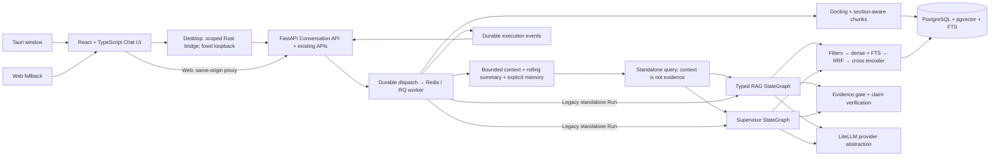
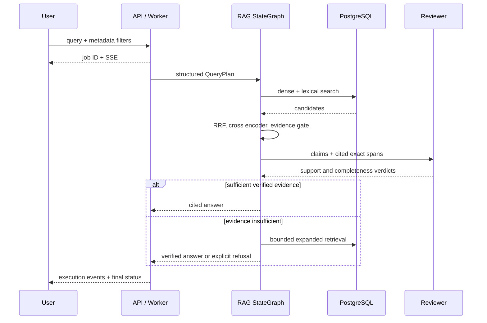
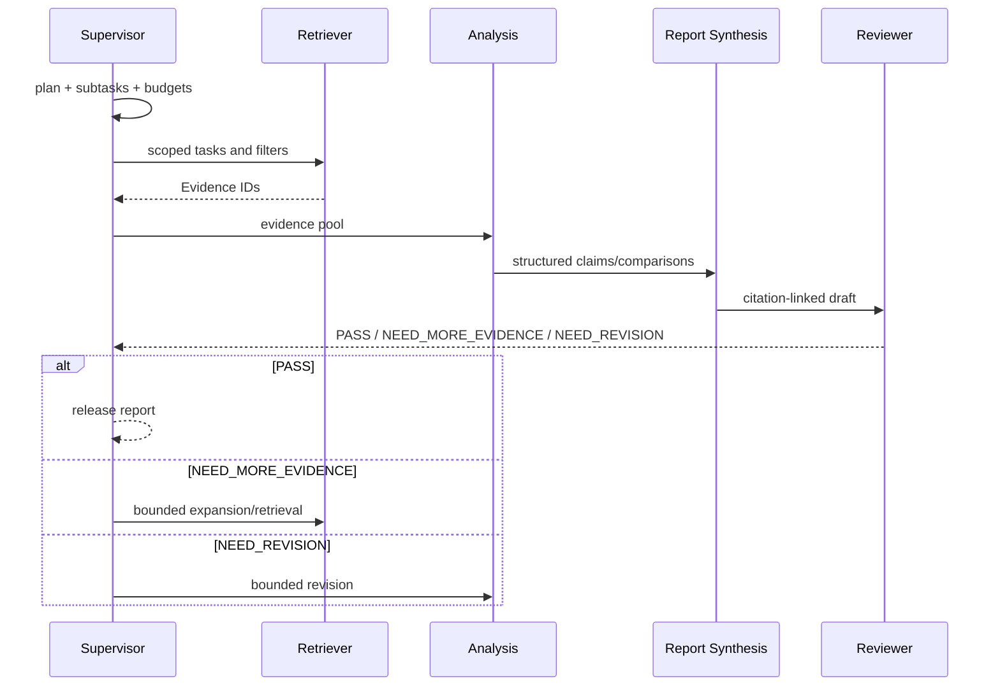

# Scientific RAGAgent

**English | [简体中文](README.zh-CN.md)**

Startup problems? Run `./scripts/diagnose.sh` (Linux) or
`powershell -NoProfile -File .\scripts\diagnose.ps1` (Windows).
See [read-only environment diagnostics](docs/environment-diagnostics.md) for prerequisites and repairs.
New users can follow the dismissible [first-use guide](docs/first-use.md) in Web or Desktop.

A local scientific literature assistant with persistent RAG/Research chats,
inspectable conversation memory and a Tauri desktop entry. It retains the existing
evidence-grounded knowledge base and Supervisor workflows. MIT licensed; paper and model-weight licenses remain
independent. No langgraph-supervisor dependency. No fabricated benchmark claims.

The final reviewed code is on
[`main`](https://github.com/maczhouyi-del/RAGSystem/tree/main).
This copy retains the original commit history and MIT license. The
[original repository](https://github.com/chouytong/RAGAgent) is preserved;
the migration starts from its `fix/engineering-hardening` commit `df75bdd`.
Historical CI and installer evidence links still refer to runs in that repository.

```bash
git clone --branch main https://github.com/maczhouyi-del/RAGSystem.git
cd RAGSystem
# First checkout only; preserve an existing runtime .env.
cp .env.example .env
# Install/start Desktop first and open Connection authorization.
npm --prefix frontend ci
npm --prefix frontend run desktop:dev
# Copy its nonsecret pairing hash into LOCAL_AUTH_TOKEN_HASH in .env.
# Then start Compose in another terminal and reconnect Desktop.
docker compose up --build
```

Open the [Web fallback](http://localhost:8080) using the optional development authorization
described in [local pairing](docs/deployment.md#local-owner-authentication).
[API docs](http://localhost:8000/docs) require a bearer for protected requests.
For an independent window, pair Desktop first as above, then start Compose.
The desktop shell connects only to `http://127.0.0.1:8000`; it does not bundle or
start Python, PostgreSQL or Redis. Rust and platform WebView prerequisites are
listed in [deployment](docs/deployment.md#desktop-ui-with-local-backend).
Requires Docker Compose v2, Git, recommended 8 GB RAM and 20 GB free disk.
The backend requires local authorization configuration; model API keys are optional for startup; inference requires configured chat providers
or local models. Local parsing/embedding/reranker weights download on first use.
`/api/health` reports process liveness; `/api/ready` checks DB, Redis and a queue
worker, without asserting model/provider inference readiness.

RAG/Research conversation turns use the `interactive` queue; PDF/arXiv use
`ingestion`; benchmarks use `evaluation`. Compose starts one dedicated worker
per queue. `/api/ready` gates DB, Redis and interactive worker availability;
`/api/queues` reports availability and pending counts for all three workloads.
See [deployment](docs/deployment.md#dedicated-workload-queues) for scaling and
migration of already queued jobs.

## Architecture



Python 3.11+, Pydantic v2, SQLAlchemy 2, Alembic, current LangGraph, LiteLLM,
Docling, PostgreSQL/pgvector, Redis/RQ; React/TypeScript/Vite; uv/npm locks,
Docker Compose, pytest/Ruff/mypy and GitHub Actions.

## Chats and local memory

RAG Chat and Research Chat have separate conversation histories, automatic titles,
rename/delete controls, ordered messages, Markdown/code blocks, citations and
collapsible execution details. Research retains Supervisor Plan, agent trace,
Reviewer Result and limitations. Reloading the Web UI or restarting the desktop
reads conversations and messages from PostgreSQL; browser `localStorage` is not
the conversation store. A URL fragment identifies the selected conversation.

The UI initially reads the latest 50 lightweight messages and loads older history
on request. SSE drives live progress; reconnect/resume reconciles new messages and
active placeholders. Run, trace and evidence details load when opened, rather than
with every history refresh. Superseded retry attempts remain audit records and
leave the context used for subsequent questions.

Each turn creates messages and an existing Run/durable dispatch intent together.
The worker persists the released assistant answer with the terminal Run/event;
SSE reconnects replay persisted execution events. Duplicate submissions use a
client UUID; retry creates a new Run and keeps the previous failure visible.
One conversation executes one turn at a time; different conversations remain
independent. Cancellation revokes publication permission and makes a best-effort
queue stop; an already dispatched provider call may still complete or incur cost.

Follow-ups pass through a Context Builder: current question, bounded recent
messages, a deterministic rolling extractive summary and explicitly added memories
resolve pronouns/named candidates into a standalone question. The original and
contextualized query are inspectable in execution details. Older excerpts may
lose information; ambiguous references fail explicitly instead of guessing.
`CONVERSATION_CONTEXT_TOKEN_BUDGET=8192` uses a multilingual approximate token estimate with UTF-8 excerpt caps
for contextualization input; this is not a provider tokenizer or a total workflow budget.
Independent questions skip the rewrite model. Context-dependent questions use selected
Top-K memory text; all structured hard filters still apply. A typed, source-linked
conversation intent/entity state survives restart beside the extractive summary.
The Memory panel exposes this state; changing memory invalidates it.

**Memory ≠ Evidence.** Messages, summaries and memories only guide intent and
retrieval. Both independent graphs retrieve fresh source evidence and retain the
existing evidence gate and claim/citation validation. A historical claim such as
“Dataset A has 500 participants” cannot itself support the next scientific answer.
Structured constraints with metadata filters intersect the current filters;
conflicts fail explicitly. Natural-language preference text alone is not a hard
SQL filter. Add, inspect or delete memory in the conversation's Memory panel;
there is no automatic hidden user profile or external memory service.

Clear Conversation Memory deletes summary/memory records and retains messages;
retained history can create a new summary on a later turn. Clear Conversation
deletes messages, associated Runs/events/dispatch records and memory while keeping
the empty conversation. Delete Conversation removes those records and the
conversation itself. Knowledge-base papers and unrelated evaluation artifacts
are retained. See [conversation/memory lifecycle](docs/conversation-memory.md).

## Local data and remote inference

With the default local Compose services, PDFs/parse files, vector indexes,
conversation history, summaries, structured memory and execution history remain
in local PostgreSQL or named filesystem volumes. There is no cloud conversation
database or SaaS memory storage. Backups, downloaded evaluation artifacts and the
desktop's cached documents are separate copies and need separate deletion.

Remote chat providers receive the necessary questions, conversation context for
rewrite and retrieved excerpts for analysis/review; hosted embedding providers
receive indexed text/search queries. Remote evaluation judges receive answer and
evidence payloads. Local persistence therefore does **not** mean all data stays
on the machine during inference. Configure local chat, embedding, reranker and
parser resources to keep inference local; initial model downloads still require
network unless cached. API keys stay in runtime environment/secrets. Recognizable
credential patterns are rejected from conversation fields; avoid pasting secrets
into free text, since pattern detection cannot identify every possible credential.

## Paper ingestion and knowledge base

Upload PDFs with optional title/authors/year/venue or import an open arXiv ID.
The original PDF, structured sections, text/tables/captions, pages, chunks and
embeddings are retained. Inspect indexing status and metadata in Knowledge Base.
Chunking stays within section and element type, with configurable token target
and overlap. Decimal/scientific-notation values stay intact; recognized Markdown
tables split at row boundaries with separately sourced headers/captions, while
formulas and tables with unknown structure remain atomic even above the target.
New arXiv imports freeze the official versioned ID before downloading. Source
status starts as `unknown`; manually marked withdrawn/retracted papers are
excluded from retrieval. Dense/lexical retrieval share all metadata predicates. Annotate
chunk entities for dataset/method/metric filters through the API.

```bash
curl -F 'file=@paper.pdf' -F 'title=Paper title' -F 'authors=Alice;Bob' \
  http://localhost:8000/api/papers/upload
curl -H 'Content-Type: application/json' -d '{"arxiv_id":"2408.09869"}' \
  http://localhost:8000/api/papers/arxiv
```

## RAG and research

RAG handles fact queries, method comparison and constrained retrieval. Every
released factual claim has validated structured Evidence IDs, exact supporting
text, paper, section, page and chunk. Model-authored citation markers are rejected;
only deterministic formatting emits citations. The reviewer must also support
every attached claim/evidence pair; an unrelated citation requires revision.
Multi-query retrieval reranks against the original question or current subtask,
preserving that target during expansion. The configured rerank threshold
restricts the evidence supplied to generation and verification in both workflows.
Missing support triggers bounded expansion then explicit refusal.
Retrieval scores are heuristics, not calibrated model confidence probabilities.



Research generates a structured plan/subtasks, invokes Retriever and Analysis,
then deterministic Report Synthesis and Reviewer. NEED_MORE_EVIDENCE returns to
retrieval; NEED_REVISION returns to analysis. Retrieval, revision and total
iteration budgets prevent infinite loops. Drafts remain clearly labeled.
Retries retain a bounded union of accepted evidence. Replanned tasks retain
completion only if their full task content is unchanged, even when IDs are reused.



```bash
curl -H 'Content-Type: application/json' -d '{"mode":"rag"}' \
  http://localhost:8000/api/conversations
# Replace CONVERSATION_ID and use a new client UUID for each new logical turn.
curl -H 'Content-Type: application/json' \
  -d '{"content":"Which datasets are used?","client_request_id":"00000000-0000-4000-8000-000000000001"}' \
  http://localhost:8000/api/conversations/CONVERSATION_ID/messages
# Existing single-run API clients remain supported:
curl -H 'Content-Type: application/json' \
  -d '{"query":"How do the papers compare training methods?","filters":{"year_start":2023}}' \
  http://localhost:8000/api/rag/query
curl -H 'Content-Type: application/json' \
  -d '{"research_question":"Compare methods, datasets and metrics for scientific retrieval."}' \
  http://localhost:8000/api/research
curl -N http://localhost:8000/api/research/RUN_ID/events
```

## Providers and local models

Edit `.env` runtime secrets and `config/agents.yaml`, or nonsecret Settings UI
mapping. Each agent can independently use OpenAI, Anthropic, DeepSeek, Ollama or
an OpenAI-compatible local server through LiteLLM. Embeddings/reranker have
separate configuration. YAML expands only nonsecret `*_MODEL` variables in model
fields; API mapping writes reject unresolved templates. Local Host validation and
same-origin browser write checks protect the local API. Provider connectivity
tests never return keys. Default chat mappings use a dated model identifier;
returned provider model identities are recorded when available.
Hosted embeddings support `openai`, `cohere`, `cohere_chat` and `voyage` prefixes;
compatible servers use `openai/<model>` with an explicit base. Embedding endpoint
identity is frozen for both indexing and SDK calls. A hosted
`EMBEDDING_REVISION` is an operator index label, not server-weight pinning.
Local Hub adapters resolve a requested revision to an immutable SHA on first use;
set that SHA explicitly to reproduce later runs. The `local:v2` fingerprint requires
reembedding old local indexes. `python -m ragagent.reindex --all-indexed` updates
vectors atomically per paper while preserving chunk/citation IDs.
See [deployment](docs/deployment.md) for all-local/hosted embedding examples,
model caches, migrations, network requirements and troubleshooting.

## Evaluation and development

Evaluation page accepts a labeled dataset and runs retrieval ablation. APIs
and the page also run RAG, multi-agent and conversational evaluation. Conversational evaluation
uses the production Context Builder and independent graph pipelines to measure
context resolution, evidence grounding, memory isolation and long-summary cases;
it does not substitute memory for retrieval. Each run writes results.json/results.md
with Git commit, dataset hash, timestamp, execution configuration and actual
per-query metrics/latency. Each case checkpoints results; partial/failed terminal
runs keep downloadable artifacts and can be resumed explicitly using
`resume_run_id` if dataset, source, configuration and corpus identities match.
Resumed costs retain separate current-attempt and previous-attempt records.
Generation results also retain the final output,
evidence and raw judge response for inspection. Semantic judge results are
explicitly MODEL_BASED; unknown provider charges make total cost incomplete.
Workflow usage includes hosted embeddings; in-flight/failed paid calls are
recorded with unknown cost rather than assumed free. Worker Runs persist paid-call
usage updates; evaluation artifacts also checkpoint those updates between cases.
Synchronous search/provider tests return request usage only, and the reindex CLI
prints cumulative usage; neither has a durable Run billing ledger.

```bash
python scripts/annotation_template.py my-annotations.json --count 100
uv sync
uv run ruff format . && uv run ruff check . && uv run mypy src
uv run pytest -q
npm --prefix frontend ci
npm --prefix frontend run lint
npm --prefix frontend run check
npm --prefix frontend run build
npm --prefix frontend exec -- playwright install chromium
npm --prefix frontend run test:e2e
npm --prefix frontend run test:transport
npm --prefix frontend run desktop:check
npm --prefix frontend run desktop:test
npm --prefix frontend run desktop:build
```

There are **no 100 human-labeled examples** in this repository. The unannotated
100-row template must be filled by humans. Optional synthetic corpus/data are
**DEMO ONLY / NOT A BENCHMARK / NOT MANUALLY ANNOTATED**. No improvement number
is claimed. See [evaluation](docs/evaluation.md) for definitions and limitations.
Core tests require no paid API/model downloads; PostgreSQL/pgvector integration
runs in CI. `scripts/smoke.py` tests a fresh empty Compose deployment through
the frontend proxy, including a real missing-key worker failure and terminal
SSE; it does not test successful inference. [Stage log](docs/stage-log.md) records
actual verification.

## Documentation and limits

[Implementation/acceptance baseline](docs/MASTER_SPEC.md) ·
[Product upgrade handover](docs/product-upgrade-report.md) ·
[Repair decisions](docs/adr/README.md) ·
[Reference/license review](docs/reference-review.md) · [Architecture](docs/architecture.md) ·
[Data model](docs/data-model.md) · [Conversation and memory](docs/conversation-memory.md) · [Retrieval](docs/retrieval.md) ·
[Paper library search](docs/paper-library.md) ·
[Agents](docs/agents.md) · [API](docs/api.md) · [Deployment](docs/deployment.md) ·
[Contributor rules](AGENTS.md).

V1 is a trusted local single-user application. English PostgreSQL FTS, exact
vector search and lexical token counts are deliberate first-release choices.
Docling equation/OCR/table fidelity depends on the document and models. Semantic
verification can be wrong; scientific conclusions need human review. Provider
capabilities, latency and model cost vary. Automatic graph checkpoint resumption,
public/multi-tenant security and ANN tuning require further work. Models and
PDFs are not vendored. Restricted cloud network/model access is reported as a
verification limitation, never disguised with mock inference.
Desktop packaging/signing and GUI behavior depend on the platform; tests with
scripted providers establish contracts, not real-model conversational quality.
Actual upgrade checks and remaining verification gaps are recorded in the stage
log for this checkout, rather than inferred from an available build command.

The baseline and ADRs were written during the engineering repair; they are not
recovered historical specifications or prior acceptance evidence. The stage log
separates actual checks from real PDF/model/provider/benchmark validation that
remains unverified.

Multilingual model adoption remains unverified: the [real-model matrix](docs/benchmarks/multilingual.md) records current/candidate/translation configurations with **Not measured** metrics until approved human gold and licensed immutable weights are supplied. CI scripted providers do not establish retrieval quality. Defaults are unchanged.

Windows MSI/NSIS artifacts are built by the [Desktop workflow](.github/workflows/desktop.yml); use only successful-run artifacts and verify hashes. See [Windows installation and limitations](docs/deployment.md#windows-installers-and-build-provenance). Builds are unsigned; Windows 11 human acceptance remains separate.

Completed answers are labeled **Passed automated evidence validation**; this
checks evidence links and model-based support and does not guarantee scientific
truth. Claim supporting spans use validated original text offsets, with the full
original quote retained as fallback. PDF panels show the requested page; native
viewers may require manual navigation. In Settings, **本机诊断与版本** separates
authorization, database, Redis, workload queues and build provenance from
model loading/inference, which remains untested until actual tasks run.
See [engineering evidence and unverified acceptance](ENGINEERING_REVIEW.md).

Validated implementation `f803d824`: backend/frontend/Compose and Linux/Windows Desktop CI passed. Actual unsigned MSI/NSIS artifacts and independently checked SHA-256 are linked in [the engineering report](ENGINEERING_REVIEW.md#final-implementation-ci-and-inspected-windows-artifacts). Real multilingual quality and Windows 11 human acceptance remain unverified.
