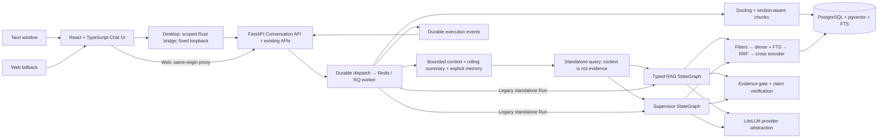
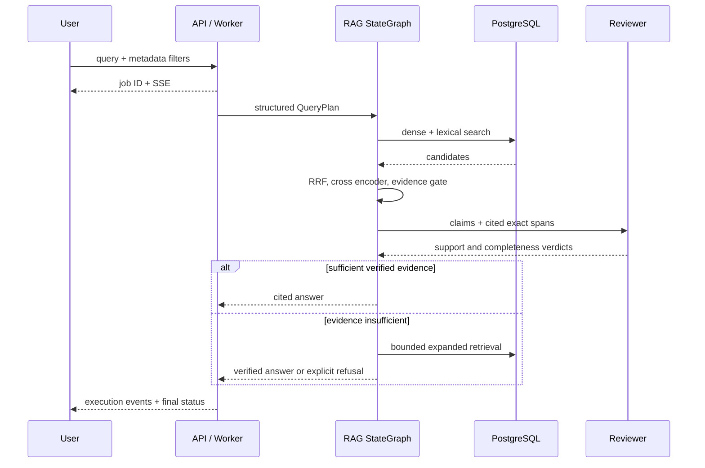
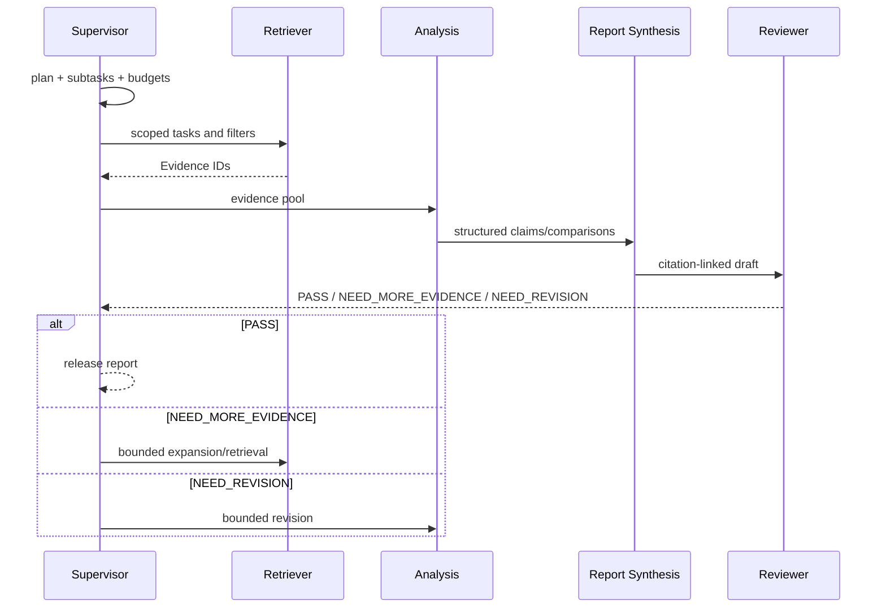

# Scientific RAGAgent

**[English](README.md) | 简体中文**

本地科研文献助手，提供持久化的 RAG/Research 对话、可查看的会话记忆，以及
Tauri 桌面入口。它保留了现有的基于证据的知识库和 Supervisor 工作流。
项目采用 MIT 许可证；论文和模型权重分别受各自许可证约束。
不依赖 langgraph-supervisor，不声称未经验证的基准测试成绩。

默认源码分支为
[`main`](https://github.com/maczhouyi-del/RAGSystem/tree/main)。
此副本保留原始提交历史和 MIT 许可证；
[原仓库](https://github.com/chouytong/RAGAgent)继续保留。
迁移基于原仓库 `fix/engineering-hardening` 分支的 `df75bdd` 提交。
历史 CI 和安装包验证证据仍链接到原仓库中的实际运行记录。

## 下载与安装测试版

从 GitHub Releases 下载 **[v0.2.0-beta.1 测试版](https://github.com/maczhouyi-del/RAGSystem/releases/tag/v0.2.0-beta.1)**，应用内部版本为 **0.2.0**。
需要同时下载**桌面安装包和同平台部署 ZIP**。桌面安装包是客户端；原生部署助手通过 Docker
启动 PostgreSQL/pgvector、Redis、API、三个 worker 和 Web。
**仍需安装 Docker；普通用户不需要在电脑上安装 Python、Node.js、Rust 或 Git。**

| 平台 | 桌面安装包 | 配套部署包 |
| --- | --- | --- |
| Windows 11 x64（优先） | MSI 或 EXE，二选一 | `RAGSystem-deployment-windows-x86_64.zip` |
| macOS Apple Silicon | aarch64 DMG | `RAGSystem-deployment-macos-aarch64.zip` |
| macOS Intel | x64 DMG | `RAGSystem-deployment-macos-x86_64.zip` |
| Linux x64（Ubuntu 24.04） | deb 或 AppImage | `RAGSystem-deployment-linux-x86_64.zip` |

1. 下载对应文件，按照 Release 的 `SHA256SUMS.txt` 核对 SHA256。
   `release-manifest.json` 记录实际构建 SHA、平台、版本和校验值。
2. Windows/macOS 安装并启动 Docker Desktop；Linux 安装 Docker Engine 与 Compose ≥2.24。
   Windows 按 Docker 官方引导开启 WSL2/虚拟化并使用 Linux containers。
3. 安装桌面客户端，把部署 ZIP 解压到长期保留、当前用户可写的目录。
4. 打开桌面的“本机授权”，复制非敏感配对哈希。运行 `RAGSystem-Setup.exe`（Windows）或
   `./RAGSystem-Setup`（macOS/Linux），选择 **2 配对并启动**，粘贴哈希；等待完整后端初始化成功。
5. 在助手中通过隐藏输入保存 API 密钥并重启服务，在 Settings 配置 provider/model 角色。
   导入 PDF，等待 indexed 后进入 RAG 或 Research，按需导出报告。真实模型调用可能收费；
   本地 embedding/reranker 的权重会在首次使用时下载。

[Windows/macOS/Linux 完整安装与首次使用教程](docs/installation/README.md) ·
[数据、备份、升级、还原和卸载](docs/installation/data-and-upgrades.md) ·
[常见问题](docs/installation/troubleshooting.md) ·
[安装后本地真实科研评测](docs/installation/local-evaluation.md)

建议 **16 GB 内存、至少 20 GB 可用磁盘**，模型与论文另需空间。首次后端构建需要互联网。
Web 保留 `http://127.0.0.1:8080` 入口，通过助手 **9 Web 配对**设置独立凭据。
关闭桌面窗口不会自动停止后端；用助手停止。卸载容器保留全部五个数据卷，不要通过删除卷修复安装。
API 密钥只保存到私有运行时文件，桌面凭据保存在系统密钥库；不得写入报告或备份。

这是**未签名、未 macOS notarize 的 Pre-release**。各平台原生构建与自动化工程结果可在 CI 核查；
**真实 Windows 11/macOS/Linux 人工安装仍为 NOT EXECUTED**。
安装端到端验证使用 **MOCK 模型**、真实 PostgreSQL/Redis 和真实 Docling Native PDF 解析。
**真实科研质量仍为 NOT MEASURED**；TASK-17 与 TASK-19 科研部分等待用户论文、人工金标与获准模型/预算。
不得据 MOCK 分数认定 Research 优于 RAG。Windows/Linux ARM64、其他 Linux 发行版 NOT EXECUTED。
实际结果见 Release 说明及[工程验收证据](docs/product-improvement/task-19-evidence.json)；
[此前 CI Artifact 交付记录](docs/product-improvement/task-18-delivery.md)保留原构建 SHA 与校验值，不能与新 Release 混用。

## 开发者源码部署

以下命令面向具备 Git、Node.js/npm、Rust 与平台 WebView 开发依赖的贡献者。
普通用户使用上面的测试版安装流程。已有运行时 `.env` 必须保留。

```bash
git clone --branch main https://github.com/maczhouyi-del/RAGSystem.git
cd RAGSystem
# 仅首次 checkout；保留已有运行时 .env。
cp .env.example .env
npm --prefix frontend ci
npm --prefix frontend run desktop:dev
# 将 Desktop 的非敏感配对哈希填入 LOCAL_AUTH_TOKEN_HASH。
# 在另一个终端启动 Compose，再回到 Desktop 检查授权。
docker compose up --build
```

开发诊断使用 `./scripts/diagnose.sh`（Linux）或
`powershell -NoProfile -File .\scripts\diagnose.ps1`（Windows）。
详见[环境诊断](docs/environment-diagnostics.md)、[部署说明](docs/deployment.md)和[首次使用引导](docs/first-use.md)。
`/api/health` 检查进程存活；`/api/ready` 检查数据库、Redis 与交互 worker，不代表模型能够实际推理。
API 文档位于 `http://127.0.0.1:8000/docs`，受保护接口需要本机授权。

RAG/Research 会话使用 `interactive` 队列，PDF/arXiv 使用 `ingestion`，评测使用
`evaluation`。Compose 分别启动三个独立 worker；`/api/ready` 检查交互服务所需
数据库、Redis 和交互 worker，`/api/queues` 分别报告三个队列的可用性与待处理数。
扩容及已有作业迁移见[部署文档](docs/deployment.md#dedicated-workload-queues)。

## 架构



技术栈包括 Python 3.11+、Pydantic v2、SQLAlchemy 2、Alembic、当前版本的
LangGraph、LiteLLM、Docling、PostgreSQL/pgvector、Redis/RQ，前端使用
React/TypeScript/Vite；依赖由 uv/npm 锁文件固定，配套 Docker Compose、
pytest/Ruff/mypy 和 GitHub Actions。

## 对话与本地记忆

RAG Chat 和 Research Chat 分别保存会话历史，支持自动标题、重命名、删除、
有序消息、Markdown/代码块、引用和可折叠执行详情。
Research 保留 Supervisor Plan、Agent 执行轨迹、Reviewer Result 和局限说明。
重新加载 Web UI 或重启桌面应用后，会从 PostgreSQL 读取会话与消息；
浏览器 `localStorage` 不是会话存储。URL 片段用于标识当前选中的会话。

界面先读取最近 50 条轻量消息，需要时再加载更早历史。SSE 驱动实时进度，
重连或恢复时增量读取新消息并核对执行中的占位消息。Run、执行轨迹和证据详情
在打开时读取。被重试替代的旧回答保留为审计记录，并退出后续问题的上下文。

每一轮会同时创建消息、现有 Run 和持久化调度意图。
worker 将可发布的助手回答与终态 Run/事件一起保存；SSE 重连会重放已保存的执行事件。
重复提交通过客户端 UUID 识别；重试会创建新的 Run，并保留前一次失败供查看。
同一会话一次只能执行一轮，不同会话之间独立。
取消操作会撤销结果发布权限，并尽力停止队列任务；已发出的服务商调用仍可能完成并产生费用。

追问经过 Context Builder：当前问题、有界的最近消息、确定性的滚动抽取式摘要，
以及用户明确添加的记忆，共同将代词或已命名的候选对象解析成独立问题。
原始问题和上下文化后的问题可在执行详情中查看。
旧内容的摘录可能丢失信息；指代不明确时会明确失败，而不是猜测。
`CONVERSATION_CONTEXT_TOKEN_BUDGET=8192` 使用多语言近似 token 估算及 UTF-8 摘录字节上限来约束
上下文化输入，并非服务商 tokenizer 的计数，也不是整个工作流的预算。
独立问题跳过改写模型；追问只选择相关 Top-K 记忆文本，全部硬过滤条件仍然生效。
带来源的结构化会话意图/实体状态与抽取式摘要一同持久化，重启后可恢复；
Memory 面板可查看，修改记忆后状态失效并重新构建。

**记忆 ≠ 证据。** 消息、摘要和记忆只用于理解意图与指导检索。
两个独立的 Graph 都会重新检索本轮的原文证据，并保留现有的证据准入、
论断验证和引用验证。例如，历史对话中的“数据集 A 有 500 名参与者”，
不能直接支撑下一轮科研回答。
带元数据过滤条件的结构化约束会与当前过滤条件取交集；冲突时会明确失败。
只有自然语言偏好文本，并不构成强制 SQL 过滤条件。
可在会话的 Memory 面板中添加、查看或删除记忆；
系统不会自动建立隐藏用户画像，也不使用外部记忆服务。

Clear Conversation Memory 删除摘要与记忆记录，并保留消息；
保留下来的历史可能在后续对话中重新生成摘要。
Clear Conversation 删除消息、关联的 Run/事件/调度记录和记忆，但保留空会话。
Delete Conversation 删除上述记录以及会话本身。
知识库论文和无关的评测产物会保留。详见
[会话与记忆生命周期](docs/conversation-memory.md)。

## 本地数据与远程推理

使用默认本地 Compose 服务时，PDF/解析文件、向量索引、会话历史、摘要、
结构化记忆和执行历史保存在本地 PostgreSQL 或命名文件系统卷中。
系统没有云端会话数据库或 SaaS 记忆存储。
备份、下载的评测产物和桌面缓存文档属于独立副本，需要分别删除。

远程聊天服务商会收到必要的问题、用于改写的会话上下文，以及用于分析/审查的检索片段；
托管嵌入服务商会收到待索引文本和检索问题。
远程评测裁判会收到回答与证据载荷。
因此，本地持久化**不等于**推理期间所有数据都留在本机。
如需本地推理，请配置本地聊天、嵌入、重排和解析资源；
除非已有缓存，首次模型下载仍需要网络。
API key 仅放在运行时环境变量或 secrets 中。
会话字段会拒绝可识别的凭据模式；不要将密钥粘贴到自由文本中，
因为模式检测无法识别每一种可能的凭据。

## 论文导入与知识库

可上传 PDF，并可选提供标题、作者、年份、会议/期刊；也可导入开放的 arXiv ID。
系统保留原始 PDF、结构化章节、文本/表格/图注、页码、chunk 和嵌入向量。
可在 Knowledge Base 中查看索引状态和元数据。
切分限制在同一章节和元素类型内，目标 token 数和重叠范围可配置。
小数与科学计数法数值保持完整；可识别的 Markdown 表格按行边界切分，
表头/图表说明保留各自来源，而公式与结构未知的表格保持完整，即使超过目标大小。
新导入的 arXiv 论文会在下载前固定官方带版本的 ID。
来源状态初始为 `unknown`；手动标记为撤回或撤稿的论文会被排除在检索之外。
稠密检索与词法检索使用相同的全部元数据过滤条件。
可通过 API 标注 chunk 实体，以支持数据集、方法和指标过滤。

```bash
curl -F 'file=@paper.pdf' -F 'title=Paper title' -F 'authors=Alice;Bob' \
  http://localhost:8000/api/papers/upload
curl -H 'Content-Type: application/json' -d '{"arxiv_id":"2408.09869"}' \
  http://localhost:8000/api/papers/arxiv
```

## RAG 与科研分析

RAG 支持事实查询、方法比较和带约束的检索。
每一个发布的事实论断都具备经过验证的结构化 Evidence ID、精确支持文本，
以及论文、章节、页码和 chunk 定位。
模型自行编写的引用标记会被拒绝；只有确定性的格式化过程生成引用。
Reviewer 还必须确认每一个附带的论断/证据对都得到支持；不相关的引用需要修订。
多查询检索针对原始问题或当前子任务进行重排，在查询扩展期间保留这一目标。
配置的重排阈值会限制两个工作流提供给生成与验证环节的证据。
缺少支持时，会先进行有界扩展，再明确拒答。
检索分数是启发式分值，不是经过校准的模型置信概率。



Research 生成结构化计划和子任务，调用 Retriever 和 Analysis，
然后执行确定性的 Report Synthesis 与 Reviewer。
NEED_MORE_EVIDENCE 返回检索；NEED_REVISION 返回分析。
检索、修订和总迭代预算防止无限循环。草稿始终明确标注。
重试保留已接受证据的有界并集。
重新规划任务时，只有完整任务内容未变的任务才会保留完成状态，即使复用了相同 ID。



```bash
curl -H 'Content-Type: application/json' -d '{"mode":"rag"}' \
  http://localhost:8000/api/conversations
# Replace CONVERSATION_ID and use a new client UUID for each new logical turn.
curl -H 'Content-Type: application/json' \
  -d '{"content":"Which datasets are used?","client_request_id":"00000000-0000-4000-8000-000000000001"}' \
  http://localhost:8000/api/conversations/CONVERSATION_ID/messages
# Existing single-run API clients remain supported:
curl -H 'Content-Type: application/json' \
  -d '{"query":"How do the papers compare training methods?","filters":{"year_start":2023}}' \
  http://localhost:8000/api/rag/query
curl -H 'Content-Type: application/json' \
  -d '{"research_question":"Compare methods, datasets and metrics for scientific retrieval."}' \
  http://localhost:8000/api/research
curl -N http://localhost:8000/api/research/RUN_ID/events
```

## 服务商与本地模型

编辑 `.env` 中的运行时密钥、`config/agents.yaml`，或通过 Settings UI 设置非密钥映射。
每个 Agent 都可通过 LiteLLM 独立使用 OpenAI、Anthropic、DeepSeek、Ollama，
或兼容 OpenAI 的本地服务。嵌入与重排有各自的配置。
YAML 只在模型字段中展开不含密钥的 `*_MODEL` 变量；
API 映射写入会拒绝未解析的模板。
本地 Host 校验和浏览器同源写入检查保护本地 API。
服务商连通性测试不会返回密钥。
默认聊天映射使用带日期的模型标识；如果服务商返回实际模型身份，也会记录。
托管嵌入支持 `openai`、`cohere`、`cohere_chat` 和 `voyage` 前缀；
兼容服务使用 `openai/<model>`，并显式设置 base 地址。
嵌入端点身份会同时固定用于索引和 SDK 调用。
托管服务的 `EMBEDDING_REVISION` 是运维人员指定的索引标签，并不固定服务端模型权重。
本地 Hub 适配器首次使用时，会将请求的 revision 解析为不可变 SHA；
要复现后续运行，请显式设置该 SHA。
`local:v2` 指纹要求重新嵌入旧的本地索引。
`python -m ragagent.reindex --all-indexed` 会按论文原子更新向量，同时保留 chunk/引用 ID。
全部本地/托管嵌入示例、模型缓存、迁移、网络要求和故障排查见
[部署文档](docs/deployment.md)。

## 评测与开发

Evaluation 页面接受带标注的数据集并运行检索消融评测。
API 和页面也支持 RAG、多 Agent 和会话评测。
会话评测使用生产环境的 Context Builder 和独立 Graph 流水线，
衡量上下文解析、证据支撑、记忆隔离和长摘要案例；不会用记忆替代检索。
每次运行写出 results.json/results.md，记录 Git commit、数据集哈希、时间戳、
执行配置，以及实际的逐查询指标与延迟。
每个案例都会保存结果检查点；部分完成或失败的终态运行仍保留可下载产物，
在数据集、来源、配置和语料身份匹配时，可通过 `resume_run_id` 显式续跑。
续跑费用分别保留当前尝试和先前尝试的记录。
生成评测还会保留最终输出、证据和原始裁判响应，以便检查。
语义裁判结果明确标记为 MODEL_BASED；未知的服务商收费会使总费用不完整。
工作流用量包含托管嵌入；进行中或失败的付费调用会记录为费用未知，而不是假定免费。
worker Run 持久化付费调用用量更新；评测产物也会在案例之间保存这些更新的检查点。
同步检索/服务商测试只返回当前请求用量，重建索引 CLI 打印累计用量；
两者都没有持久化的 Run 计费台账。

```bash
python scripts/annotation_template.py my-annotations.json --count 100
uv sync
uv run ruff format . && uv run ruff check . && uv run mypy src
uv run pytest -q
npm --prefix frontend ci
npm --prefix frontend run lint
npm --prefix frontend run check
npm --prefix frontend run build
npm --prefix frontend exec -- playwright install chromium
npm --prefix frontend run test:e2e
npm --prefix frontend run test:transport
npm --prefix frontend run desktop:check
npm --prefix frontend run desktop:test
npm --prefix frontend run desktop:build
```

仓库中**没有 100 条人工标注样例**。未标注的 100 行模板必须由人工填写。
可选合成语料/数据明确标记为
**DEMO ONLY / NOT A BENCHMARK / NOT MANUALLY ANNOTATED**
（仅供演示 / 不是基准测试 / 未经人工标注）。不声称任何提升数值。
指标定义和局限见 [评测文档](docs/evaluation.md)。
核心测试不需要付费 API 或模型下载；PostgreSQL/pgvector 集成测试在 CI 中运行。
`scripts/smoke.py` 通过前端代理测试全新的空 Compose 部署，
包括真正缺少密钥时的 worker 失败与终态 SSE；它不测试成功推理。
[阶段日志](docs/stage-log.md) 记录实际验证结果。

## 文档与局限

[实现/验收基线](docs/MASTER_SPEC.md) ·
[产品升级交付说明](docs/product-upgrade-report.md) ·
[修复决策](docs/adr/README.md) ·
[参考项目/许可证审查](docs/reference-review.md) · [架构](docs/architecture.md) ·
[数据模型](docs/data-model.md) · [会话与记忆](docs/conversation-memory.md) · [检索](docs/retrieval.md) ·
[Agent](docs/agents.md) · [API](docs/api.md) · [部署](docs/deployment.md) ·
[贡献者规则](AGENTS.md)。

V1 是面向可信本地环境的单用户应用。
英文 PostgreSQL FTS、精确向量检索和词法 token 计数，是首个版本的有意选择。
Docling 的公式、OCR 和表格保真度取决于具体文档与模型。
语义验证可能出错，科研结论需要人工复核。
服务商能力、延迟和模型费用各不相同。
Graph 检查点自动续跑、公共/多租户安全与 ANN 调优仍需要进一步工作。
模型和 PDF 不随仓库分发。
受限云端网络或模型访问会明确列为验证局限，绝不会用模拟推理掩盖。
桌面打包、签名和 GUI 行为取决于平台；
使用脚本化服务商的测试验证的是接口约定，而不是真实模型的多轮对话质量。
当前 checkout 的实际升级检查和剩余验证缺口记录在阶段日志中，
不会因为存在构建命令就推断检查已经通过。

基线和 ADR 是工程修复期间编写的文档，
不是恢复的历史规格或此前的验收证据。
阶段日志区分了实际完成的检查，
与仍未验证的真实 PDF、模型、服务商和基准测试验证。

多语言模型采用仍未验证：[真实模型矩阵](docs/benchmarks/multilingual.md) 将现有模型、候选模型与翻译变体的指标标为 **Not measured**，需提供经审查的人工金标与已核验许可/版本的权重才能实测。CI 的脚本化 provider 不证明检索质量，默认配置保持不变。

本机授权与 Web 开发临时凭据见 [部署说明](docs/deployment.md#local-owner-authentication)。原生凭据保存在系统凭据库，JS 只读取配对哈希；受保护的 API、SSE 与文献读取均需授权。

Windows MSI/NSIS 制品由 [Desktop 工作流](.github/workflows/desktop.yml) 构建；仅使用成功运行的制品并核对哈希。见 [Windows 安装与限制](docs/deployment.md#windows-installers-and-build-provenance)。构建未签名，Windows 11 人工验收需单独完成。

回答完成状态为 **已通过自动证据校验**：引用与模型支持检查不保证科学事实正确。
逐结论支持片段使用经过范围检查的原文字符位置；无法验证时保留完整原文。
PDF 面板明确目标页，系统查看器可能需要手动跳页。Settings 的“本机诊断与版本”
分别显示授权、数据库、Redis、各任务队列与构建来源；模型加载和推理需真实任务验证。
实际测试证据与尚未验证的验收项见 [工程整改报告](ENGINEERING_REVIEW.md)。

历史工程基线提交 `f803d824` 的 backend/frontend/Compose 与 Linux/Windows Desktop CI 均已通过。真实未签名 MSI/NSIS 制品及下载后独立核对的 SHA-256 见[工程报告](ENGINEERING_REVIEW.md#final-implementation-ci-and-inspected-windows-artifacts)。多语言真实质量与 Windows 11 人工验收仍未验证。
