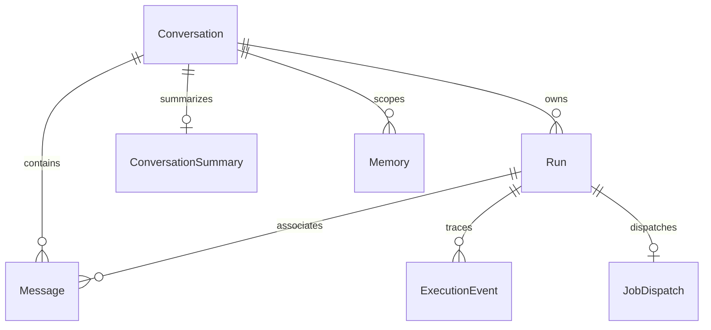

# Data model

Paper has ordered PaperAuthor links to Author; Section has an explicit parent
and unique `(paper_id, identity)`. Its heading/path is a display label, not a
unique identity. Parser elements and chunk drafts carry `section_ids` parallel
to `section_path`; real Docling heading occurrences receive distinct node IDs.
Ingestion encodes node ancestry as structured JSON identity. Fixtures without
node IDs use the heading array as structured JSON, avoiding delimiter collisions
but requiring node IDs to distinguish repeated identical paths.
The existing section filter is a display-path/heading predicate and can match
multiple structural nodes with the same label; it is not a section-ID selector.

Paper separates indexing `status` from source `source_status` (`unknown`,
`active`, `withdrawn`, `retracted`). New imports start unknown; status changes
are explicit operator annotations. Known withdrawn/retracted sources are
excluded from retrieval. arXiv sources retain `arxiv_family_id`, positive
`arxiv_version`, versioned `arxiv_id` and source URL. Each family/version is
unique; distinct versions may have the same PDF checksum. Uploaded PDFs retain
a partial unique checksum constraint. Legacy unversioned IDs keep null version;
the migration does not invent the old PDF's historical version.

Migration 0008 adds immutable application-captured `original_metadata` (JSONB;
SQL NULL for unknown legacy origins), positive `metadata_version` and
`overridden_fields`. Upload origins describe user-filled values; arXiv origins
record fetched Atom fields and pinned identity/byte checksum. Current Paper
fields/author links can be corrected separately. New PATCH clients provide the
expected version, checked under a row lock before atomic updates; unchanged
updates do not increment it. Legacy unchecked PATCH remains compatible.
PDF bytes, source version and chunk/section/vector associations are untouched.
Downgrade rejects non-pristine provenance/edit records to prevent silent loss.

Migration 0009 adds `paper_deletions`: immutable source/chunk/Evidence IDs,
deletion time, owned relative file manifests/checksums, revoked Run IDs,
affected evaluation IDs and the latest cleanup Run FK. GIN indexes support
deleted chunk/Evidence checks. It has no FK to the removed Paper and contains
no source text. An explicit confirmation retires Paper and cascaded derivatives
in one transaction, redacts attributed historical snapshots and creates the
cleanup Run/outbox. Shared authors/entities remain; associated orphans and
their entity subtypes are pruned. Failed file/Redis cleanup leaves the ledger
and retired library state intact; retry moves forward with a new Run ID.
Nonempty ledgers prevent downgrade. See [lifecycle](paper-deletion.md).

Chunk records UUID, paper/section, complete section path,
pages, element type, exact text, ordinal, lexical token count, JSON metadata,
configured-dimensional vector and a generated English tsvector with GIN index.
Parser elements retain source IDs. Chunk JSON metadata includes `source_spans`,
which map each original element's character offsets to offsets inside the chunk,
and `source_context` for independently sourced header/caption excerpts. Each
context carries source ID, element type, section, page and exact quote offsets;
`source_offset` locates the excerpt within its original parsed element. Context
is not fabricated into chunk text. Old chunks do not retroactively acquire these
source maps merely by upgrading the schema or reembedding vectors.

Entity has a type and normalized name. ChunkEntity links occurrences to exact
chunks. Dataset/Method/Metric extend Entity; EntityRelation includes a source
chunk. Entity filters operate on recorded occurrences; missing annotations do
not match. Annotation can be supplied manually; automated extraction must be
verified before persistence.

Evidence stores a chunk FK, exact character offsets/quote and retrieval scores.
API evidence joins paper/section/page metadata. Claims reference these evidence
IDs. Quotes must equal `chunk.content[span_start:span_end]`.
Review additionally returns unique claim/evidence support pairs; every citation
attached to a released claim must have a matching supported pair. Exact offsets
prove text identity, not semantic truth or correct extraction from the PDF.

Run and ExecutionEvent persist job requests/results and a replayable ordered
execution timeline. `JobDispatch` records one durable intent per Run, dispatch
attempts/error code, dispatch time and claim time. It commits with the Run;
database row locks protect dispatch and execution claims. The terminal event
commits with terminal Run state so SSE can drain its stable watermark.
Redis is only the queue. Credentials never enter these
records. Uploaded PDFs are content-hashed and deduplicated.
Worker Run paid-call usage snapshots include in-flight unknown charges and returned
model identities without prompts or secrets. Evaluation artifacts checkpoint
each usage update and case result separately on disk. Explicit resume creates a
new Run and preserves earlier attempt usage as a separate history, supplementing
artifact usage from the prior persisted Run when available. Synchronous search
and provider-test responses and reindex stdout have no persistent Run ledger;
their response/output loss cannot be recovered from this data model.

The first migration is a frozen explicit schema generated from this model,
including pgvector extension and FTS index. Use Alembic, never `create_all` as
an application startup migration. Embedding dimensionality is fixed at first
migration; changing it requires an explicit migration and complete reindex.
The section-identity migration assigns each existing section a `legacy:<UUID>`
identity without splitting its path. It cannot recover sections already merged
by the former display-path key; reingest those original PDFs to reconstruct the
hierarchy. New revisions preserve the frozen initial migration.
Migration `0003` adds source identity/status and the arXiv-aware checksum policy;
its downgrade refuses to restore global checksum uniqueness when duplicate
checksums exist. Explicit reembedding replaces all vectors/fingerprint for one
paper in a transaction without replacing chunks, entity links or Evidence IDs.
Chunk token counts use deterministic lexical tokens, not a provider tokenizer;
provider context limits must be enforced independently.

## Conversation records

Migration `0004` adds four tables and nullable associations on Run. Existing
papers, chunks, citations, Runs and events stay intact; legacy Runs have no
conversation association. The migration upgrades the existing database and
does not create replacement knowledge-base tables. Downgrading `0004` removes
the new conversation data; back up before a downgrade.

| Model/table | Stored fields and invariants |
|---|---|
| Conversation / `conversations` | UUID, title, `mode=rag\|research`, archived flag, metadata, created/updated timestamps; list order uses updated timestamp and ID. Mode is fixed after creation; the archived field is reserved, without an archive endpoint. |
| Message / `messages` | UUID, conversation FK, role (`user`, `assistant`, internal `system`), content, nonnegative ordinal, nullable Run FK, status, metadata and timestamps. `(conversation_id, ordinal)` is unique and indexed; listing uses ordinal rather than timestamps. Retry lineage adds nullable self-FK `retry_of_message_id`, positive `attempt_number` and `is_effective` (migration 0005 preserves earlier audit rows). |
| ConversationSummary / `conversation_summaries` | One record per conversation, content, covered `through_ordinal`, positive version, source message IDs/method metadata and timestamps. The text is unverified extractive conversation context, not scientific Evidence. |
| Memory / `conversation_memories` | UUID, conversation FK, `kind=goal\|constraint\|term\|preference\|task`, optional key, content, optional structured filters, metadata and timestamps. Only `constraint` accepts filters; the API permits at most 100 memories per conversation. |
| Run additions | Nullable conversation FK and client request UUID. `(conversation_id, client_request_id)` is unique. A partial unique index on queued/running conversation Runs enforces one active turn; legacy single-run APIs are unaffected. |

The send transaction creates a user message, queued assistant placeholder, Run and
dispatch intent together. Both messages reference that Run on the initial turn;
retry adds a new assistant/Run while preserving the user's original association and
all earlier attempts. Assistant transitions follow their Run. Final message content,
terminal status and final event persist together; draft event payloads cannot become
completed assistant messages. `cancelled` is a terminal Run/message status.

Run request keeps the original turn and associated message IDs. Run result and
context events record the contextualized query, context version/configuration,
used source IDs and conservative input estimate. They do not create scientific
Evidence from message IDs. Only freshly retrieved paper/chunk evidence is available
to the selected graph's generation and verification paths.

Conversation FKs cascade to messages, summary, memories and conversation Runs;
Run deletion cascades to dispatch/events. Message's Run FK uses `SET NULL` when a
Run is independently removed. The supported clear/delete API operations remove
the conversation's messages and linked Runs together, so these operations do not
leave identifiable conversation requests/results behind in the database.
Deleting conversation records does not delete PDFs/chunks, unrelated evaluation
Runs/artifacts, exported files, app-cache copies or backups. PostgreSQL deletion is
logical deletion of records, not guaranteed forensic erasure of storage media.

The API exposes explicit local memory creation/deletion, not automatic personal
profile extraction. Known credential patterns in conversation title/message/memory
input are rejected; no API-key value field is present. Arbitrary free text can still
contain unrecognized sensitive material, so users should not paste secrets.
